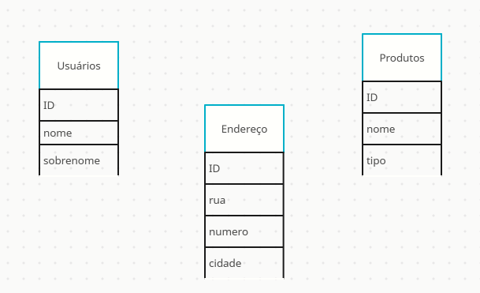

# Modelagem de Banco de Dados

## MER e DER

O Modelo Entidade-Relacionamento (MER) é representado através de diagramas chamados Diagramas Entidade-Relacionamento (DER).

## Entidade

As entidades são nomeadas com substantivos concretos ou anstratos que representem de forma clara sua função dentro do domínio.

## Atributos

Os atributos são as características ou propriedades das entidades. Eles descrevem informações específicas sobre uma entidade.

## Relacionamentos

Os relacionamentos representam as associações entre entidades.

## Cardinalidade
A cardinalidade representa o numero possível de interações entre entidades.

- Relacionamento 1..1 (um para um)
- Relacionamento 1..n (Um para muitos)
- Relacionamento n..n (muitos para muitos)
